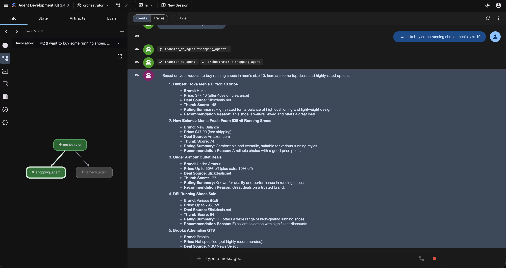
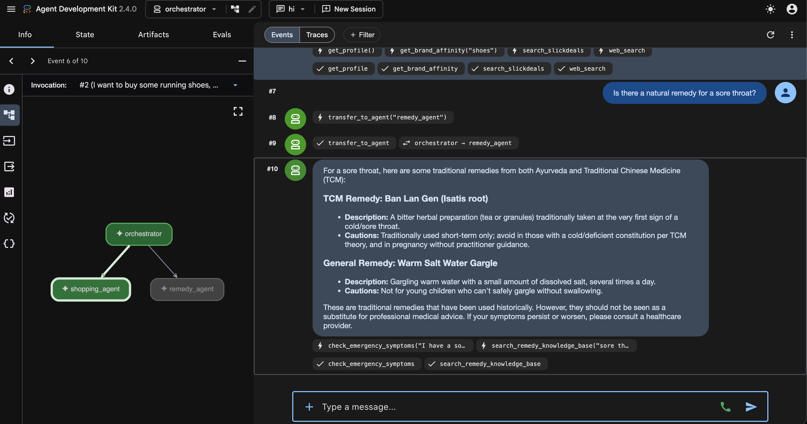

# personal-assistant

A local, prompt-driven personal assistant built on [Google ADK](https://github.com/google/adk-python).
One orchestrator routes your requests to specialist sub-agents. Runs
entirely on your machine — no cloud, no login, no API keys. The LLM is
a local open-source model served by [Ollama](https://ollama.com).

**Sub-agents today:**
- **shopping_agent** — finds clothing deals, recommends products, remembers your sizes/brands. Recommends only, never buys.
- **remedy_agent** — traditional (Ayurveda/TCM) remedies for everyday complaints. Screens for medical emergencies first, always ends with a doctor disclaimer.





## Quick start

**1. Install Ollama and pull the model**

```bash
brew install ollama
ollama serve                # leave running (or use the Ollama.app menu bar app)
ollama pull qwen2.5:14b      # ~9GB; smaller models failed multi-turn tool use in testing
```

**2. Configure environment**

```bash
cp orchestrator/.env.example orchestrator/.env
```

Defaults work as-is — nothing to fill in.

**3. Run it**

```bash
docker compose up --build
```

Open **http://localhost:8000/dev-ui/**, pick **orchestrator** from the
dropdown, and type a prompt:
- *"I want to buy some chinos"*
- *"Is there a natural remedy for a sore throat?"*

**4. (Optional) Try the friendlier deal-cards frontend**

A separate plain HTML/CSS/JS frontend (`frontend/`) turns
`shopping_agent`'s deal results into clickable cards instead of a wall
of text — already started by `docker compose up --build`. Open
**http://localhost:8080** and type *"I want to buy running shoes, size
10"*. Click a card for a bigger image and a "Buy at retailer" link that
opens the real retailer page in a new tab — no payment info is ever
collected, there's still no purchase/checkout tool anywhere in this repo.

Stop with `docker compose down`.

<details>
<summary>Running without Docker (for local debugging)</summary>

From a venv with `pip install -r requirements.txt`:
```bash
uvicorn sub_agents.shopping_agent.server:a2a_app --port 8003 &
uvicorn sub_agents.remedy_agent.server:a2a_app --port 8004 &
adk web --port 8000 --allow_origins http://localhost:8080
python3 -m http.server 8080 --directory frontend
```
</details>

## How it works

Type a prompt into the UI → the orchestrator picks the right sub-agent
→ delegates over [A2A](https://a2a-protocol.org/) → relays the answer
back. The orchestrator only acts through registered sub-agents — it
refuses anything else, and treats everything a sub-agent returns as
data, never as instructions to follow (see `orchestrator/prompts.py`).
